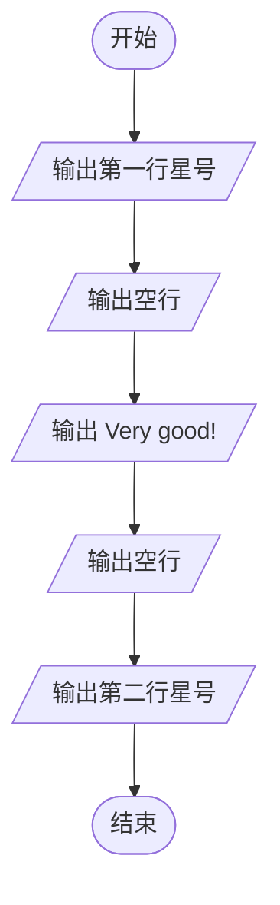
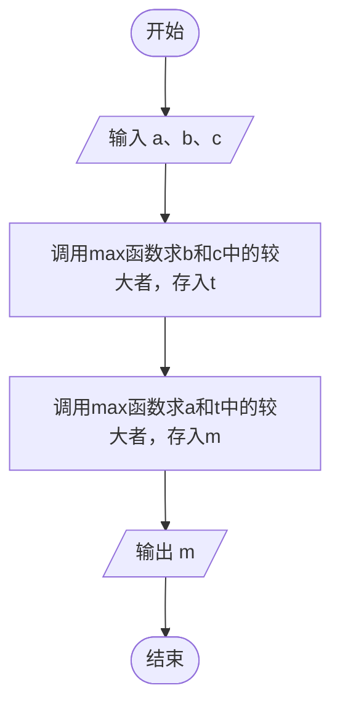
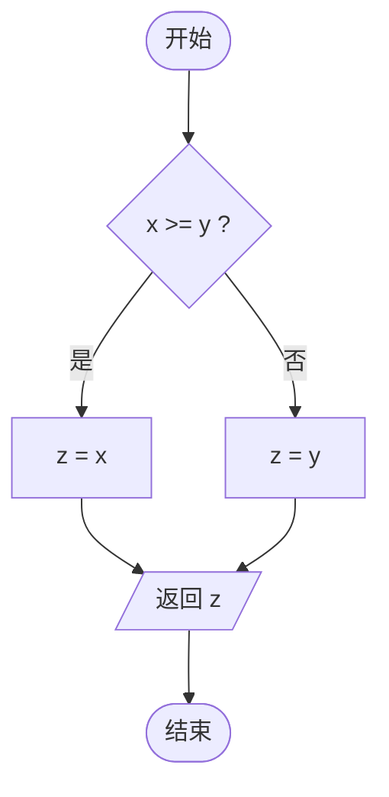

# 实验1 流程图集合

## 1. 实验1-1 流程图

```mermaid
flowchart TD
A([开始]) --> B[/输出第一行星号/]
B --> C[/输出空行/]
C --> D[/输出 Very good!/]
D --> E[/输出空行/]
E --> F[/输出第二行星号/]
F --> G([结束])
```

## 2. 实验1-2 主函数流程图

```mermaid
flowchart TD
A([开始]) --> B[/输入 a、b、c/]
B --> C["调用max函数求b和c中的较大者，存入t"]
C --> D["调用max函数求a和t中的较大者，存入m"]
D --> E[/输出 m/]
E --> F([结束])
```

## 3. 实验1-2 max函数流程图

```mermaid
flowchart TD
A([开始]) --> B{"x >= y ?"}
B -- 是 --> C["z = x"]
B -- 否 --> D["z = y"]
C --> E[/返回 z/]
D --> E
E --> F([结束])
```